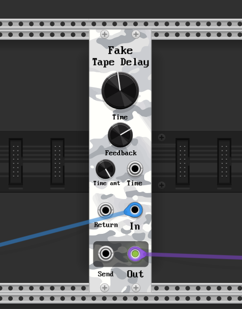

# camouflage

Camouflage-brand modules for VCVRack

## Fake Tape Delay

Fake Tape Delay is intended to be a neutral-sounding tape delay with a fixed-length tape and variable speed.

There are essentially two kinds of tape delays:

* variable tape length, fixed playback speed - these include 99% of delays in software (VCV Delay for example), because they are easy to implement; also some hardware tape delays that have fixed-length tape but change the delay by changing the distance between record and playback heads ([Dynacord Echo](https://theguitarchannel.biz/2016/02/dynacord-echocord-super-76-review-of-a-real-tape-echo/) for example)
* fixed tape length, variable tape speed - about half of hardware tape delays (RE-201 comes to mind), some hardware emulation (everything based on PT2399 chip), some software (Korg Volca Keys and Electribe have it)

**Why does it matter?**

Both kind of delays sound identical _unless_ we change change the tape speed. Then the difference is staggering and it produces one of my most favourite "radiophonic" sound-effects.

**How to tell what kind of delay you are using?**

Turn the delay feedback to maximum, let the sound fill the tape, then change the delay time. If the sound changes in pitch permanently, it's variable speed, if you hear just single tape "wow" and then it sounds as before, it's the fixed-speed delay.

**Why are most software emulations fixed-speed?**

* they are easier to implement (just one read, one write per sample; maybe some interpolation)
* variable-speed tape delay requires two resamplings: one from input to tape, second from tape to output; and both need to operate in sync
* no-one really cares

**"Fake Tape Delay" overview**

* fixed-length, variable-speed tape delay (tape length is adjustable in the context menu!)
* architecture: input is mixed with output of delay-line (weighted by `Feedback`); the mix is sent to output and back to the delay-line
* `Time` parameter sets the tape speed (speed=1 means speed equivalent to realtime, so by default a 100ms echo; speed=0.5 means half speed, etc.)
* `Time` modulation input with attenuation (beware that this input is linear in tape speed, not in octaves)
* `Feedback` knob that sets the delay-line mix into the signal (goes up to 100%, if you want more use insert)
* Insert (send/return) that goes after delay-line, before mix
* Input band-limiting filter (but not on output! If you run tape on 2x speed you will get aliasing)
* Neutral sounding: no internal sound coloring or clipping (except the artifacts resulting from linear interpolation - it DOES sound crunchy on low speeds)

**Patch ideas**

* modulate the tape-speed with square LFO
* put a slew-rate limiter on `Time` modulation input to simulate "tape catching up after speed has been changed"
* put saturation as send effect on insert (ideally - a tape saturation!)
* put bandpass filter with LFO on cutoff as send effect

# Author

Drop me a line at thement at ibawizard dot net for inquiries, suggestion, or if you just want to chat.
